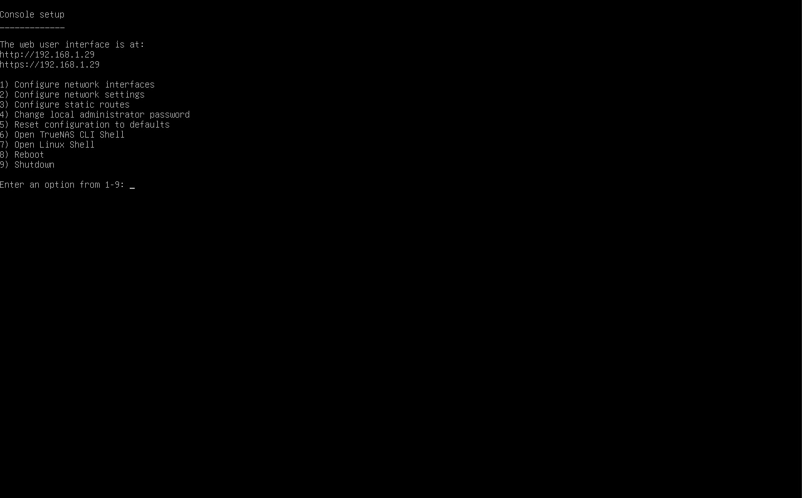

# Instalasi TrueNAS Scale di Ubuntu Server

Panduan ini menjelaskan langkah-langkah untuk menginstal TrueNAS Scale di server yang sebelumnya menjalankan Ubuntu Server.

## Prasyarat

- Sebuah server atau PC yang bisa Anda gunakan untuk TrueNAS Scale.
- Sebuah USB drive (minimal 8GB atau lebih besar).
- File ISO TrueNAS Scale.
- Software untuk membuat USB bootable (misalnya, Balena Etcher, Rufus).

## Langkah-langkah Instalasi TrueNAS Scale

### 1. Unduh ISO TrueNAS Scale

Kunjungi [situs web TrueNAS](https://www.truenas.com/download-truenas-scale/) dan unduh ISO TrueNAS Scale terbaru.

### 2. Buat USB Bootable

Gunakan software seperti Balena Etcher atau Rufus untuk membuat USB bootable dengan file ISO TrueNAS Scale.

**Untuk Balena Etcher:**

1. Buka Balena Etcher.
   
2. Pilih file ISO TrueNAS Scale.
   
3. Pilih USB drive Anda.
   
4. Klik "Flash" untuk membuat USB bootable.
   

### 3. Cadangkan Data

Sebelum melanjutkan, pastikan Anda telah mencadangkan data penting di server karena instalasi akan menghapus semua data pada drive yang digunakan untuk instalasi.

### 4. Boot dari USB

1. Masukkan USB bootable ke server Anda.
2. Reboot server dan masuk ke pengaturan BIOS/UEFI (biasanya dengan menekan tombol seperti F2, F12, DEL, atau ESC saat booting).
3. Ubah urutan boot agar boot dari USB drive terlebih dahulu.
   
4. Simpan perubahan dan keluar dari pengaturan BIOS/UEFI. Server sekarang akan boot dari USB drive.

### 5. Instal TrueNAS Scale

1. Setelah server boot dari USB drive, Anda akan melihat menu installer TrueNAS Scale.
   
   

   
   
3. Pilih "Install/Upgrade" dan tekan Enter.
   
    
   
5. Ikuti petunjuk di layar untuk menginstal TrueNAS Scale. Ini termasuk memilih drive target untuk instalasi (catatan: semua data pada drive ini akan dihapus).
6. Setelah instalasi selesai, lepaskan USB drive dan reboot server.

### 6. Konfigurasi Awal

1. Setelah server reboot, TrueNAS Scale akan mulai. Konsol akan menampilkan alamat IP untuk mengakses antarmuka web TrueNAS.
   
2. Buka browser web di komputer yang terhubung ke jaringan yang sama dan masukkan alamat IP tersebut.
3. Ikuti wizard konfigurasi awal untuk mengatur pengaturan jaringan, membuat pool penyimpanan, mengatur pengguna, dll.
   

### 7. Pasca Instalasi

1. Perbarui TrueNAS Scale ke versi terbaru melalui antarmuka web.
2. Konfigurasikan layanan dan aplikasi tambahan sesuai kebutuhan.

Dengan mengikuti langkah-langkah ini, Anda seharusnya dapat menginstal dan mengkonfigurasi TrueNAS Scale di server Anda. Jika Anda mengalami masalah atau memerlukan bantuan lebih lanjut, jangan ragu untuk bertanya!
