# Instalasi TrueNAS Scale di Proxmox VE 8.2

Panduan ini menjelaskan langkah-langkah untuk menginstal TrueNAS Scale sebagai VM di Proxmox VE versi 8.2.

## Prasyarat

- Server Proxmox yang sudah diinstal dan dikonfigurasi.
- File ISO TrueNAS Scale.
- Akses ke antarmuka web Proxmox.

## Langkah-langkah Instalasi TrueNAS Scale

### 1. Unduh ISO TrueNAS Scale ke Proxmox

1. Kunjungi [situs web TrueNAS](https://www.truenas.com/download-truenas-scale/) dan copy link unduhan trueNAS Scale terbaru.
2. Masuk ke antarmuka web Proxmox.
2. Buka tab `Datacenter` > `Server Anda` > `Local` > `ISO Images`.
3. Klik tombol `Download from URL` dan tunggu muncul pop-up windownya.
   
   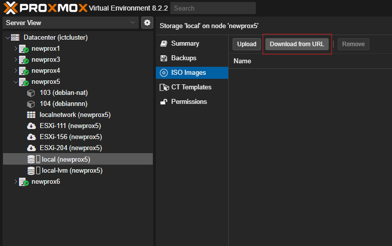

4. Paste link unduhan trueNAS Scale yang sudah anda copy sebelumnya.

   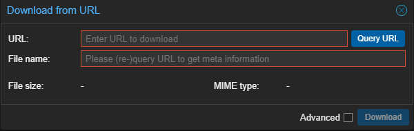

5. Pilih "Query" untuk mengambil nama file menggunakan link dari URL.

   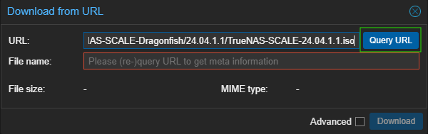

6. Pilih "Download" untuk mengunduh file dan menyimpannya di local.

   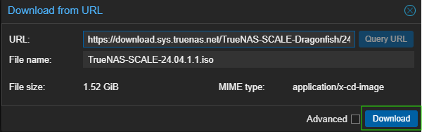

7. Jika sudah selesai makan file ISO akan muncul di halaman.

   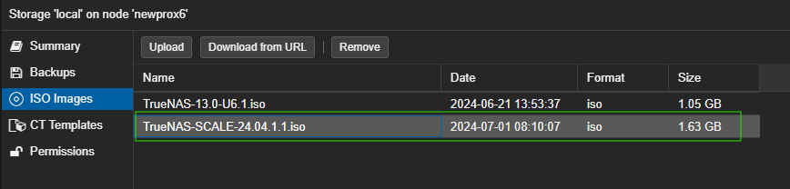

### 3. Buat VM Baru

1. Klik tombol `Create VM` di antarmuka web Proxmox.
2. Isi `VM ID` dan `Name` sesuai keinginan Anda.
   
3. Pada bagian `OS`, pilih `Do not use any media`.
4. Pada bagian `CD/DVD`, pilih `ISO File` yang telah Anda upload.
5. Pilih `SCSI` sebagai `Bus/Device` untuk `Hard Disk` dan `VirtIO` untuk `Network`.
6. Pada bagian `CPU`, pilih jumlah `cores` yang sesuai.
7. Pada bagian `Memory`, alokasikan jumlah RAM yang diperlukan (misalnya, 8GB).
8. Pada bagian `Network`, pastikan menggunakan `VirtIO`.

### 4. Konfigurasi Disk

1. Pada bagian `Hard Disk`, pilih `SCSI` sebagai `Bus/Device`.
2. Tentukan ukuran disk yang diinginkan untuk TrueNAS Scale (misalnya, 100GB).
   

### 5. Mulai VM dan Instal TrueNAS Scale

1. Setelah VM dibuat, pilih VM tersebut dan klik tombol `Start`.
2. Buka `Console` untuk VM tersebut.
   

3. Setelah server boot dari drive, Anda akan melihat menu installer TrueNAS Scale.
   
   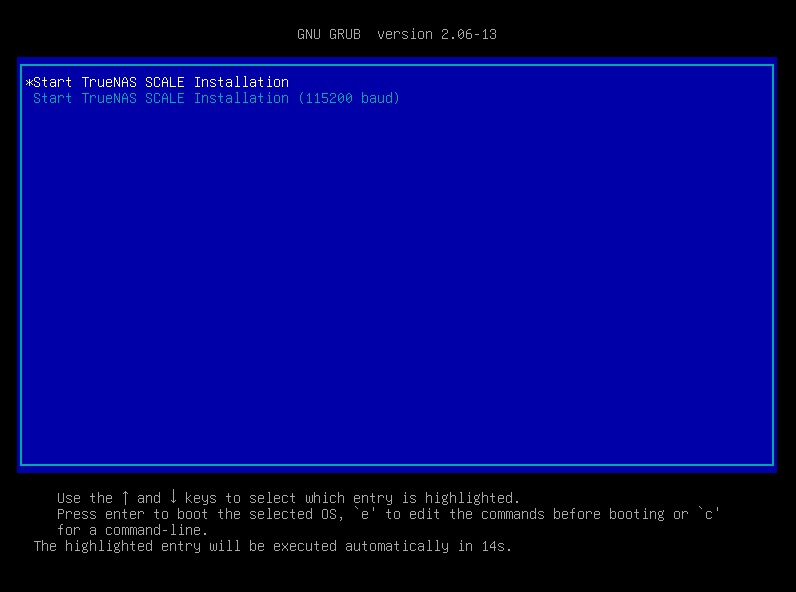
    
4. Pilih "Install/Upgrade" dan tekan Enter.

   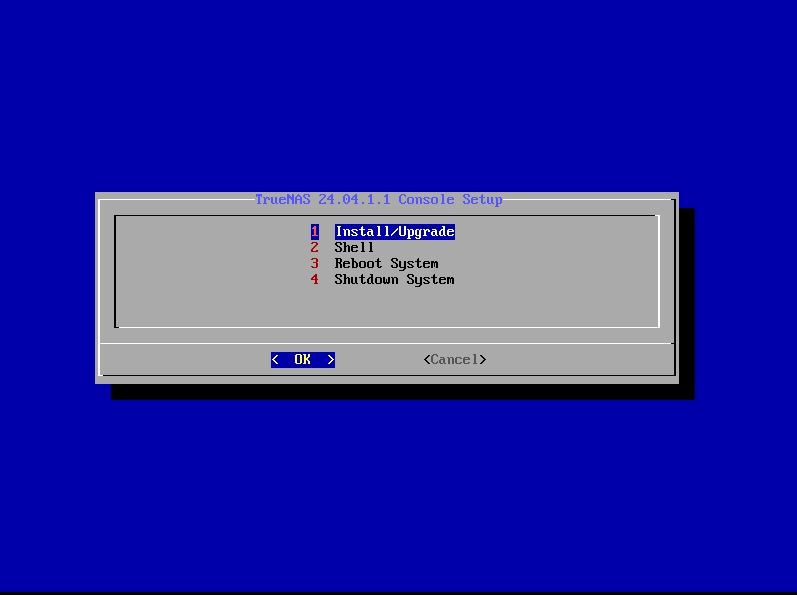
      
5. Ikuti petunjuk di layar untuk menginstal TrueNAS Scale. Ini termasuk memilih drive target untuk instalasi (catatan: semua data pada drive ini akan dihapus).

   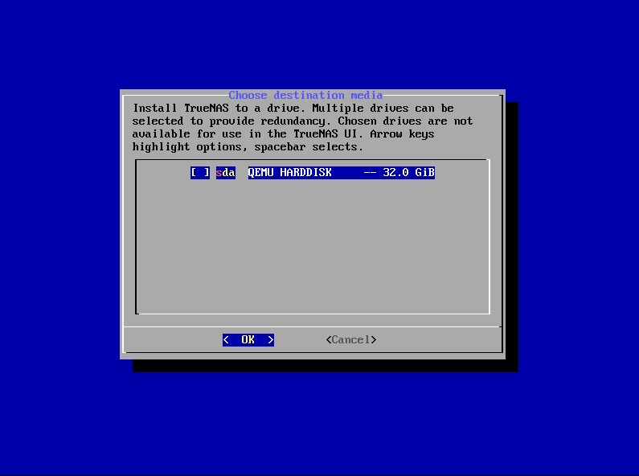

6. Pastikan data yang ada di dalam drive tersebut sudah di backup, jika sudah aman pilih "Yes".

   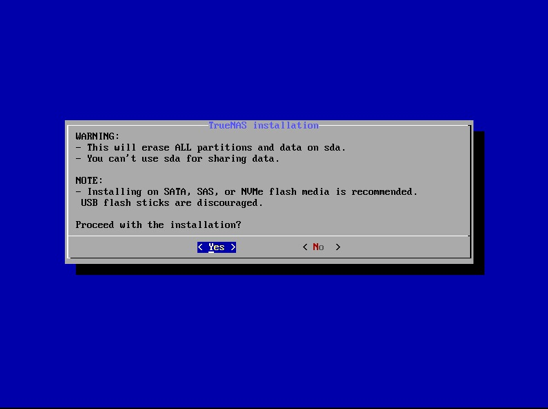

7. Pilih "Administrative user (admin)" untuk mulai membuat akun admin yang baru.

   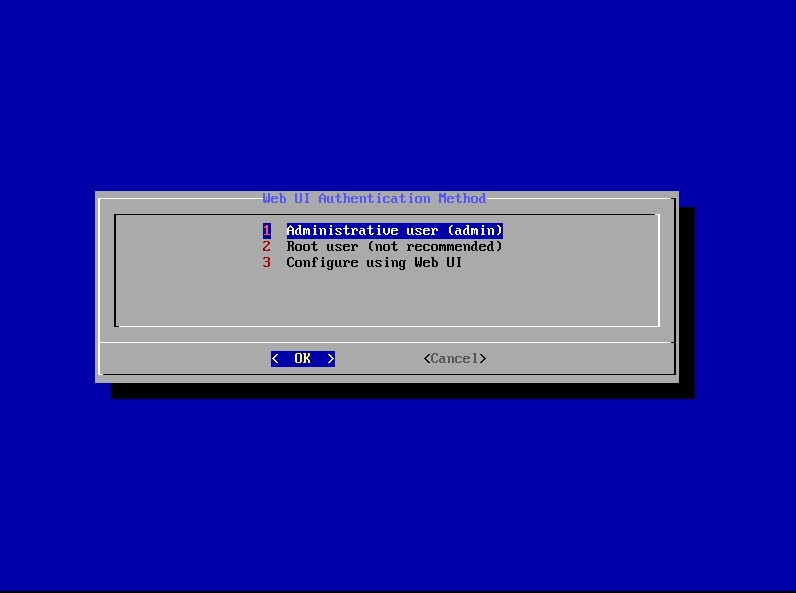

8. Masukkan password untuk user "admin" dan pastikan anda tidak lupa dengan password yang sudah dimasukkan.

   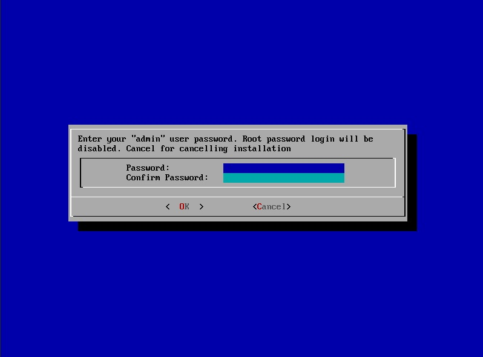

9. Pilih "OK" untuk melanjutkan ke proses selanjutnya.

   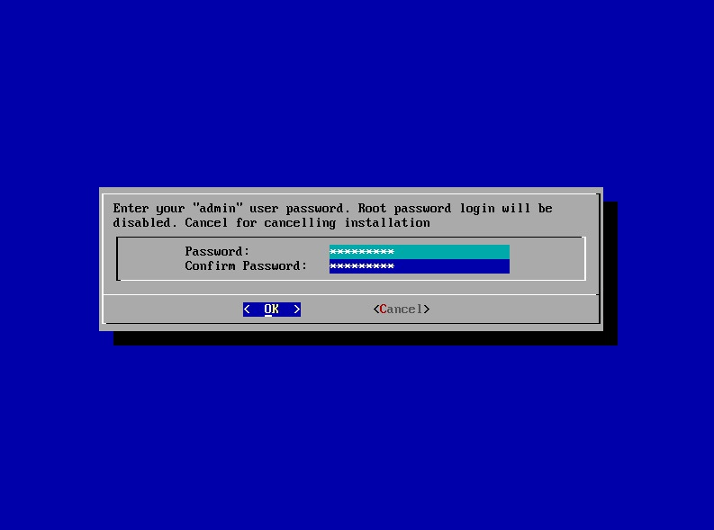

10. Pilih "Yes" jika sudah menggunakan hardware yang baru lalu boot dengan EFI.

   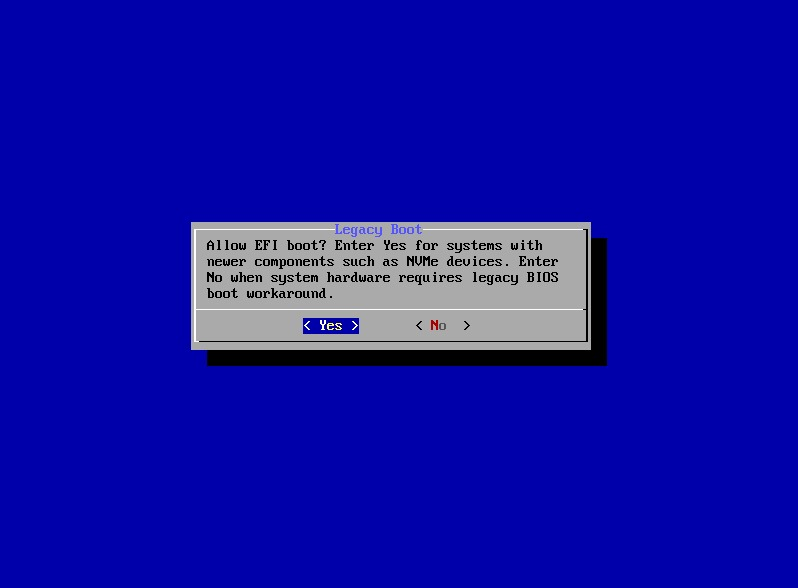

11. Proses instalasi dimulai.

   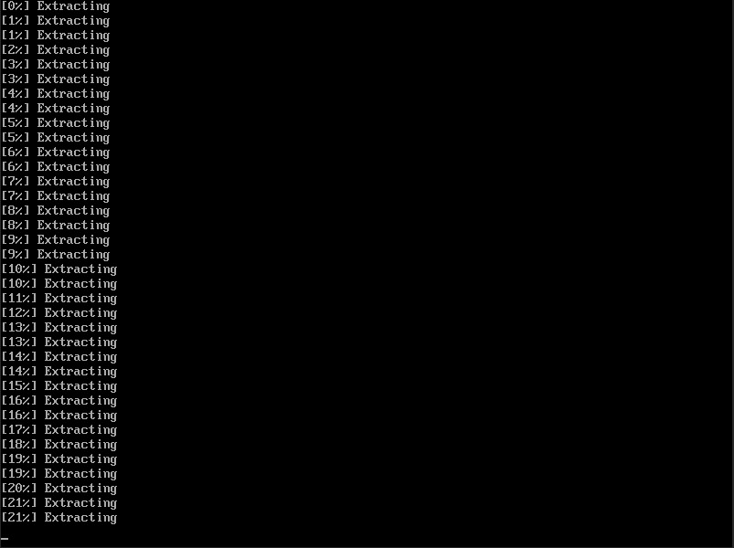
   
12. Setelah instalasi selesai, lepaskan USB drive dan reboot server.

   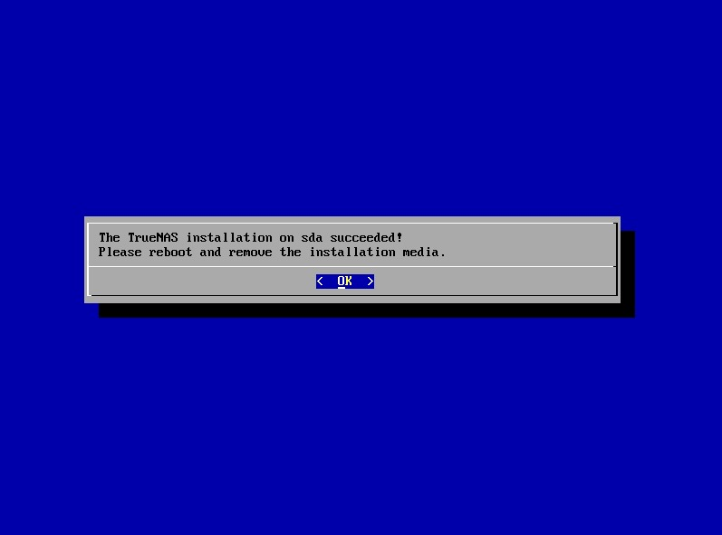

13. Pilih "Reboot System" kemudian pilih "OK".

   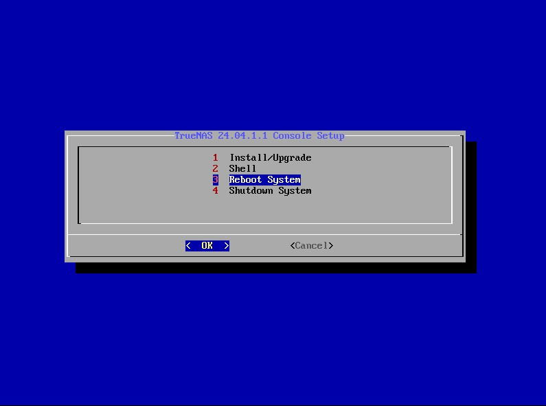

### 6. Konfigurasi Awal

1. Setelah server reboot, TrueNAS Scale akan mulai. Konsol akan menampilkan alamat IP untuk mengakses antarmuka web TrueNAS.
   
   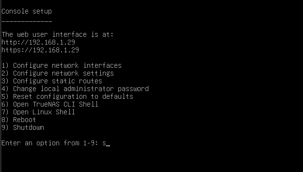
   
3. Buka browser web di komputer yang terhubung ke jaringan yang sama dan masukkan alamat IP tersebut.
4. Ikuti wizard konfigurasi awal untuk mengatur pengaturan jaringan, membuat pool penyimpanan, mengatur pengguna, dll.
   
   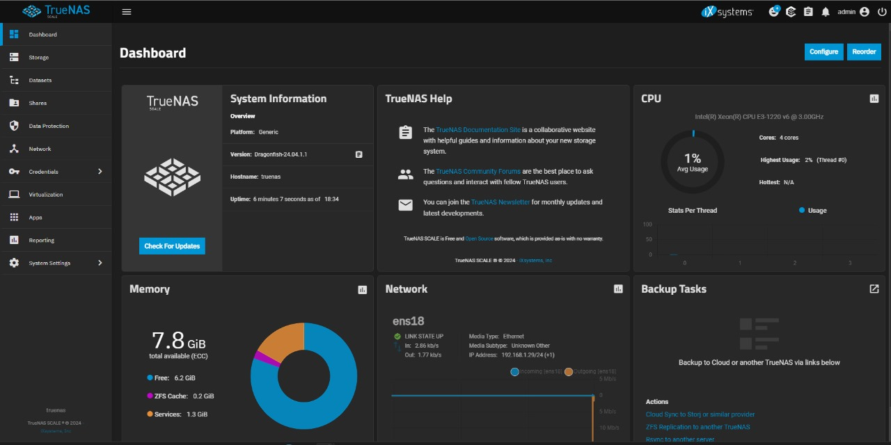

### 7. Pasca Instalasi

1. Perbarui TrueNAS Scale ke versi terbaru melalui antarmuka web.
2. Konfigurasikan layanan dan aplikasi tambahan sesuai kebutuhan.

Dengan mengikuti langkah-langkah ini, Anda seharusnya dapat menginstal dan mengkonfigurasi TrueNAS Scale di server Anda. Jika Anda mengalami masalah atau memerlukan bantuan lebih lanjut, jangan ragu untuk bertanya!
